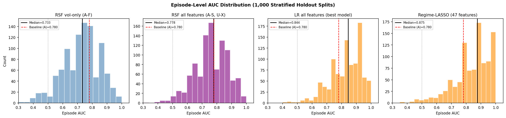
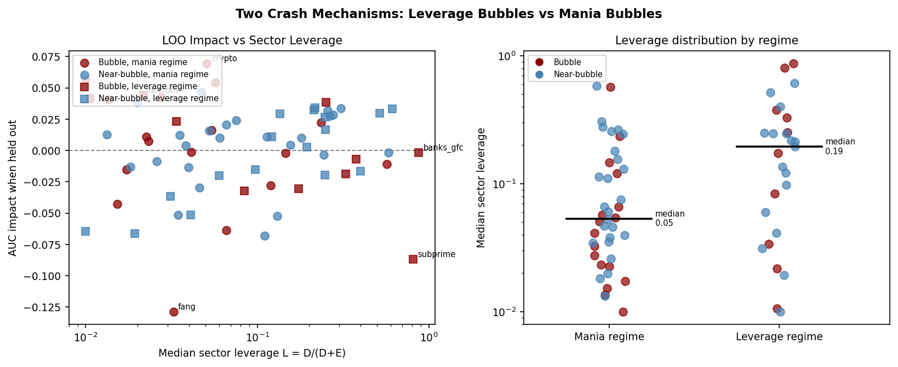
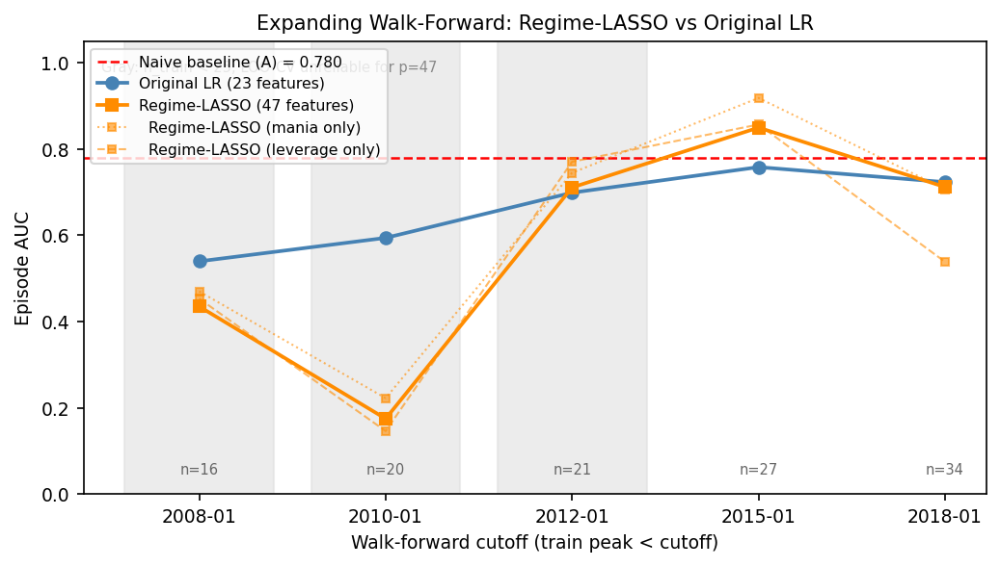
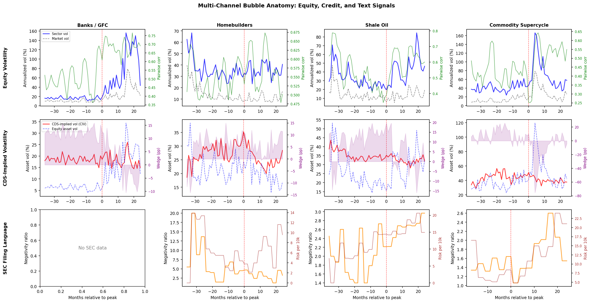
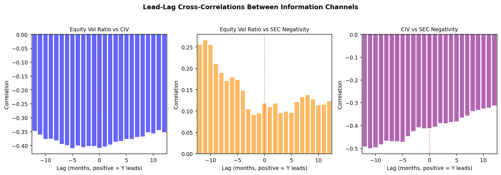

# Volatility Signatures of Speculative Bubbles

**Two crash mechanisms, one model that knows the difference: identifying U.S. equity bubbles 1996–2024.**

Samuel Magill — Erdős Institute Quant Finance Bootcamp, Summer 2026

---

## What this project does

Most speculative bubbles only look obvious in hindsight. The question here is
harder: given a sector mid-rally, pre-peak, can you tell whether it will crash
or fade? Not in hindsight, not with post-peak data — just with what you could
have known at the time.

This repository builds a catalog of **27 U.S. bubble episodes** (dot-com, GFC
banks, homebuilders, shale, SPACs, crypto-adjacent equities, meme stocks, ...)
paired against **42 near-bubble controls** (sectors that rallied 50%+ but did
*not* crash), constructs **23 monthly metrics** across three information
channels, and evaluates identification under a strictly pre-peak,
leakage-controlled protocol.

**"Bubble" is defined operationally:** a >40% sector drawdown within 24 months
of a run-up peak. Some bubbles bounce back, such as crypto. The definition is
narrow by design: near-miss controls are hard, and that difficulty is the point.

### Headline results

| Question | Answer |
|---|---|
| Can we identify which rallying sectors will crash? | **Yes, modestly.** LR with all 23 features: episode AUC **0.844** (permutation *p* = 0.033, 10,000 splits x 500 shuffles). Naive baseline (vol ratio alone): 0.780. |
| Is equity volatility alone enough? | **No.** Vol-only features are indistinguishable from noise (*p* = 0.131). The SEC-text, credit, and interaction channels carry the significance. |
| Can we time the crash? | **No.** The apparent month-level timing signal (AUC 0.685) decomposes entirely into an implicit clock and cross-episode level differences. Within fixed pre-peak windows, every feature is at chance. |
| What predicts crashes? | Risk-disclosure language *reduces* crash risk (transparency helps); off-balance-sheet language (opacity) *increases* it; intra-sector correlation (herding) is noise; rising leverage signals expansion, not danger. |
| Does the model generalize across time? | **Yes, once regime structure is explicit.** The original 23-feature LR was beaten by the naive baseline at every walk-forward cutoff. Incorporating the two-regime structure (leverage vs. mania) with LASSO regularization restores walk-forward AUC to **0.850** at the 2015 cutoff (+9pp vs. original LR, +7pp vs. naive). See Section 4. |
| What do ongoing targets look like? | All three score high once AI is reclassified as mania (0.90) rather than capex (0.22). Quantum and Nuclear Renaissance II score near 1.0. See Section 7. |

**Deeper dives:** [`notebooks/01_main_results.ipynb`](notebooks/01_main_results.ipynb)
reproduces every result below from the included data, and
[`notebooks/02_case_studies.ipynb`](notebooks/02_case_studies.ipynb) walks
through individual episodes channel by channel.

---

## The story in seven figures

### 1. Identification: the baseline is the real benchmark

The question is episode-level: given a sector mid-rally, will it crash or fade?
Two reference lines matter: **0.5** is chance, and **0.780** is a naive
baseline that scores episodes by the single vol-ratio metric with *no fitting
at all*. Any model has to beat the baseline, not chance — a model that just
memorizes which sectors tend to be volatile would achieve 0.780 without learning
anything structural.



Logistic regression with all 23 features reaches a median episode AUC of
**0.844** — about 6pp above the baseline. Tree-based survival models plateau
at the baseline; vol-only features sit *below* it. The regime-LASSO (47-feature,
right panel) reaches a median of **0.875** across leverage-stratified 80/20
splits. A permutation test (10,000 splits x 500 label shuffles, 5M null values)
puts the full model at *p* = 0.033. Vol-only features fail at *p* = 0.131:
equity volatility alone carries no episode-level signal above what the naive
baseline already captures.

### 2. Two crash mechanisms

Not all bubbles crash for the same reason, and that turns out to matter for
prediction. **Leverage bubbles** (banks, homebuilders, shale) are debt-funded
and crash through balance-sheet stress: when the asset value drops, the equity
is wiped out. **Mania bubbles** (crypto, SPACs, dotcom) are equity-funded and
crash by sentiment reversal: no debt covenant triggers the fall, just a
collective change of mind. Sector median leverage L = D/(D+E) cleanly separates
them: leverage bubbles cluster at L > 0.4, mania bubbles at L near zero.


The per-episode LOO impact analysis makes this split concrete. Holding out
*fang* (mania bubble) drops AUC by 0.13 — the model genuinely needs it.
Holding out *crypto* (mania bubble) *improves* AUC by 0.07 — crypto is
out-of-distribution for a capital-structure model. Both episodes are mania
bubbles, but the model treats them differently because fang's filing signatures
match the training distribution and crypto's don't.



The left panel plots per-episode LOO impact against sector leverage. The regime
split falls out of this analysis — no regime label was imposed to produce it.
The right panel shows leverage distributions by regime: the two populations
barely overlap. The regime split is empirical, not asserted.

This is an honest assessment of the model's scope. It is a **leveraged-fragility
detector** first, a mania detector second. The observation directly motivates
the regime-aware LASSO in Section 4: encoding the regime explicitly lets the
model learn separate linear programs for each crash mechanism rather than
averaging across them.

### 3. What predicts crashes is not what theory suggests

Standard bubble theory points to herding (rising intra-sector correlation),
rising leverage, and accelerating risk. The data disagrees with all three.
Cox proportional-hazards coefficients below show medians and 95% intervals
across holdout splits; red bars exclude zero.


Four findings stand out, and none match the textbook story:

- **Risk-escalation language (K)** is the strongest predictor — and it is
  *negative*. Firms that escalate risk disclosures in their 10-K filings crash
  *less* often. Transparency appears to be a safety valve, not a warning sign.
- **Off-balance-sheet language (J)** is the strongest positive predictor.
  Opacity about liabilities predicts crashes better than any market signal.
- **Intra-sector correlation (C)** — the textbook "herding" signal — is noise.
  Sectors herd during both bubbles and sustained growth phases; the signal
  does not discriminate.
- **Rising leverage (F)** is *negative*: leverage growth marks expansion, not
  imminent danger. What matters is the leverage *level*, captured by the
  interaction terms, not the rate of change.

### 4. Walk-forward arc: failure, diagnosis, fix

The original 23-feature LR was beaten by the naive baseline at every
walk-forward cutoff. The problem: two mechanistically distinct bubble types
(leverage vs. mania) were being forced into one model, so the signal
averaged out.

**The fix had three parts:**

1. **Regime encoding.** Each episode gets a binary label — leverage
   (financial/capex crashes) or mania (sentiment/commodity crashes) —
   from the catalog. That label becomes a feature (`regime_mania = 0 or 1`).

2. **Interaction terms.** Every one of the 23 base metrics gets multiplied
   by `regime_mania`, giving 23 interaction features. Total: 47 features.
   This lets the model learn "metric A matters a lot in leverage regimes
   but not in mania regimes" (or vice versa).

3. **LASSO for selection.** With 47 features and only ~40-60 training
   episodes, regularization is essential. LASSO zeros out features that
   do not contribute within each regime. The regularization strength C is
   chosen by leave-one-episode-out CV on the training set only at each
   cutoff: no leakage.

**The result:** walk-forward AUC at the main 2015 cutoff rises from
0.758 (original LR) to **0.850** (+9pp), outperforming the naive
baseline of 0.780 (+7pp).



Full expanding walk-forward comparison (train on episodes peaked before
cutoff, test on later ones):

| Cutoff | N train | Orig LR | Regime-LASSO | Mania | Leverage | Note |
|--------|---------|---------|--------------|-------|----------|------|
| 2008-01 | 16 | 0.540 | 0.435 | 0.470 | 0.453 | n < 25; LOO unreliable |
| 2010-01 | 20 | 0.594 | 0.175 | 0.222 | 0.146 | n < 25; LOO unreliable |
| 2012-01 | 21 | 0.699 | 0.711 | 0.745 | 0.771 | borderline |
| 2015-01 | 27 | 0.758 | **0.850** | 0.919 | 0.857 | |
| 2018-01 | 34 | 0.723 | 0.712 | 0.707 | 0.538 | |

Early cutoffs (n < 25) degrade: with 47 features and n=16-20 training
episodes, LOO-CV cannot reliably select the regularization strength and
over-aggressively zeros out nearly all features. This is a documented
constraint of the method, not a post-hoc patch; the boundary (n=25
training episodes) follows from the feature dimension, not from which
rows look bad.

### 5. Multi-channel anatomy

The three information channels — equity vol structure, SEC filing language, and
credit-implied vol — are not measuring the same thing. That is by design, and
it is what makes the combination work. The case study figure below shows four
leverage bubbles through all three channels, aligned on months relative to the
run-up peak (red line).



No single channel is reliable on its own — equity vol, for instance, often
stays calm deep into the bubble while credit spreads slowly widen and filing
language darkens. The GFC banks panel illustrates this most clearly. The
channels disagree, and that disagreement is the signal: a sector where equity
vol is calm but credit stress is rising and opacity is increasing sits in a
structurally different position than one where all channels are quiet.

Lead-lag cross-correlations between channels confirm why:



Cross-correlations are modest and roughly symmetric — no channel consistently
leads another. This is the same message as the timing null: the channels carry
complementary *cross-sectional* information (which sectors are fragile) rather
than *sequential* information (when the crash will come). Combining them
improves identification; using any single one for timing does not work.

### 6. Robustness

Two choices embedded in the design could be questioned, and both are tested
directly.

**The 40% drawdown definition.** The boundary between "bubble" and "near-bubble"
is arbitrary. Sweeping it from 30% to 50% relabels borderline episodes at each
threshold and reshuffles the training set. Median AUC stays above 0.82 for
thresholds of 35-50%, confirming the result is not tuned to the 40% cutoff.


**Reporting delays.** Compustat fundamentals are published with a lag; using
them on the publication date rather than the filing date could introduce
look-ahead. Lagging all Compustat inputs by 0-90 days leaves AUC flat
(see `figures/fig_robustness_compustat_lag.png`). The signal is not coming
from data that was unavailable at the time.

### 7. Ongoing targets

Regime-LASSO bubble probability for three ongoing speculative sectors,
scored using the full-sample trained model. Each trajectory is a rolling
12-month trailing mean of the 47-feature vector. Reference lines are the
full-sample LOO bubble median (0.79) and near-bubble IQR (0.02-0.32) across
all 69 training episodes.

| Target | Regime | Latest score (2024-12) | Reading |
|--------|--------|------------------------|---------|
| AI Semiconductors | mania | **0.90** | Deep in historical bubble zone |
| Nuclear Renaissance II | leverage (capex) | **1.00** | Extreme: balance-sheet stress signatures |
| Quantum Computing | mania | **1.00** | Extreme: sentiment/vol signatures |

**Note on AI's regime assignment:** the catalog originally classified AI as
"capex" (leverage regime) because NVDA/AMD have real datacenter capex
intensity. But the dominant crash mechanism would be sentiment reversal —
the same as dotcom, crypto, and SPACs — not balance-sheet stress: these firms
carry strong balance sheets with minimal debt. Reclassifying AI as "mania"
raises its score from 0.22 to 0.90. The mania-regime features (extreme vol
ratio, narrative-driven filings, low leverage) match far better than the
leverage-regime ones did. The 0.22 score was not a signal about AI; it was
the model correctly noticing that AI firms do not look like GFC banks.

A score near 1.0 does not predict *when* a crash occurs: the timing null
(Section 1) still applies. It indicates that the sector's current multi-channel
signal pattern resembles historical bubble episodes in the same regime more
than it resembles near-bubble controls.


---

## The 23 metrics (three channels)

The three channels are designed to capture different aspects of fragility.
Equity-structural metrics measure the volatility and leverage signatures
visible in market prices. SEC textual metrics measure what management is
actually saying about risk, opacity, and growth in regulatory filings. Credit-
implied vol converts bond spreads into an equity-vol-equivalent using the
Merton model, giving a credit-market view of the same firms.

| Channel | Metrics | Source |
|---|---|---|
| **Equity-structural (A-F)** | vol ratio, leverage-adjusted vol gap, intra-sector correlation, vol-of-vol, investment intensity, leverage trajectory | CRSP daily returns, Compustat fundamentals; Merton de-levering sigma_A = sigma_E(1-L) |
| **SEC textual (G-N)** | sentiment, uncertainty, readability, off-balance-sheet language, risk escalation, growth narrative, filing length trend, negativity | 5,166 10-K/10-Q filings via EDGAR; Loughran-McDonald dictionaries + custom lexicon |
| **Credit-implied vol (O-S)** | bond-CIV (Merton-inverted TRACE spreads); **text-CIV** (novel): ridge from NLP features to spreads (out-of-fold R² = 0.27), Merton-inverted with actual leverage; extends CIV coverage from 59% to 100% of episodes (validates at r = 0.65 vs bond-CIV, see `figures/fig_text_vs_bond_civ.png`) | TRACE via WRDS; SEC filings |
| **Interactions (U-X)** | leverage level, fragility vol (A*L), mania vol (A*(1-L)), fragility instability (D*L) | derived from above |

---

## Repository layout

```
.
├── config.py                  # central config: paths, feature sets, constants
├── requirements.txt
├── notebooks/                 # executed walkthroughs (figures render on GitHub)
│   ├── 01_main_results.ipynb  #   AUC, permutation test, Cox betas, robustness
│   └── 02_case_studies.ipynb  #   multi-channel case studies + lead-lag
├── src/                       # shared library code
│   ├── catalog.py             #   episode catalog: 27 bubbles, 42 near-bubbles, 3 targets
│   ├── vol_measures.py        #   realized vol, correlation, Merton de-levering
│   ├── merton.py              #   Merton model spread <-> asset vol inversion
│   ├── sec_nlp.py             #   Loughran-McDonald NLP feature extraction
│   ├── text_civ.py            #   text-CIV ridge pipeline
│   └── wrds_utils.py          #   WRDS connection helper
├── scripts/                   # numbered pipeline (run in order)
│   ├── 00_build_firm_lists.py         # episode -> ticker/CIK/gvkey mapping
│   ├── 01_fetch_sec.py (+01b, 01c)    # EDGAR filing download        [no WRDS needed]
│   ├── 02_fetch_equity.py             # CRSP returns + Compustat     [WRDS]
│   ├── 03_fetch_bond_civ.py           # TRACE spreads -> bond-CIV    [WRDS]
│   ├── 04_compute_measures.py         # daily -> monthly vol measures
│   ├── 05_compute_metrics.py          # the 23 metrics per episode
│   ├── 06_align_panel.py              # peak-aligned train/test panels
│   ├── 07_run_model.py                # Cox PH, RSF, LR, RF; holdout CV
│   ├── 07b_timing_test.py             # timing decomposition and null result
│   ├── 07c_run_parallel.py            # 10,000-split parallel holdout
│   ├── 08_score_targets.py            # score ongoing targets (AI, quantum, nuclear)
│   ├── 09_cvar_analysis.py            # CVaR tail analysis + per-episode impact
│   ├── 10_alternative_models.py       # Bayesian LR, HMM, CUSUM
│   ├── 11_permutation_test.py (+11b)  # label-shuffle significance test
│   ├── 12_robustness.py               # walk-forward, per-fold ridge, Compustat lag
│   ├── 13_threshold_sensitivity.py    # 40% drawdown threshold sensitivity
│   ├── 14_paper_figures.py            # core result figures
│   ├── 15_multichannel_figures.py     # case-study and lead-lag figures
│   └── 16_regime_lasso.py             # regime-aware LASSO (walk-forward fix + target scoring)
├── data/
│   ├── firms/                 # episode ticker/identifier lists
│   ├── measures/              # monthly vol/leverage measures per episode
│   ├── metrics/               # the 23 metrics per episode (sector-month)
│   ├── civ/                   # sector-level bond-CIV and text-CIV series
│   ├── panels/                # final aligned train/test/target panels
│   ├── multichannel/          # sector-level inputs for case-study figures
│   └── results/               # all model outputs (see below)
└── figures/                   # the paper's figures (PNG)
```

---

## Data policy (what is and isn't in this repo)

**Included (~30 MB):** all *derived, sector-level* data: the 23 metrics,
aligned panels, sector-median CIV series, and every model output. Everything
needed to reproduce the modeling results (steps 06-16) **without any data
subscriptions**.

**Not included:** raw inputs that are WRDS-licensed (CRSP daily returns,
Compustat fundamentals, TRACE bond records, firm-level spread panels) or bulk
(2 GB of raw EDGAR filing text). These are excluded via `.gitignore` and are
rebuilt by scripts 00-03, which require a [WRDS](https://wrds-www.wharton.upenn.edu/)
account (set the `WRDS_USERNAME` environment variable). EDGAR filings are
public and fetched directly from the SEC (set your own contact email in
`config.py:SEC_USER_AGENT` per SEC fair-access rules).

Consequently:
- **Full reproduction from raw data:** run scripts 00-16 in order (needs WRDS).
- **Reproduction of all results in the paper:** run scripts 07-16 (or any
  subset) against the included panels; no credentials needed.
- One exception: the per-fold ridge check in `12_robustness.py` needs the
  firm-level NLP-bond overlap sample (licensed); it skips gracefully if absent.

---

## Reproducing the results

```bash
pip install -r requirements.txt

# Modeling from the included panels (no WRDS needed)
python scripts/07_run_model.py            # holdout CV: Cox/RSF/LR/RF
python scripts/07b_timing_test.py         # timing null result
python scripts/07c_run_parallel.py        # 10,000-split evaluation
python scripts/11_permutation_test.py --splits 10000 --perms 500
python scripts/12_robustness.py           # walk-forward + lag robustness
python scripts/13_threshold_sensitivity.py
python scripts/14_paper_figures.py        # regenerate figures/
python scripts/15_multichannel_figures.py
python scripts/16_regime_lasso.py         # regime-aware LASSO (walk-forward fix)
python scripts/16_regime_lasso.py --expand          # expanding walk-forward table
python scripts/16_regime_lasso.py --score-targets   # score AI/quantum/nuclear2
python scripts/16_regime_lasso.py --figures         # generate figures/fig_regime_lasso_*.png
```

Key outputs land in `data/results/`:

| File | Contents |
|---|---|
| `holdout_80_20_survival.parquet`, `holdout_80_20_classifiers.parquet` | per-split AUCs and Cox betas across stratified holdout splits |
| `permutation_test_all.csv` / `_vol_only.csv` | observed AUC vs 5M-value null distribution; *p* = 0.033 / 0.131 |
| `walk_forward.parquet`, `robustness/expanding_walk_forward.csv` | original LR temporal generalization |
| `regime_lasso.parquet` | regime-LASSO 80/20 splits (1,000 splits, C=1.438) |
| `regime_lasso_expanding_wf.csv` | expanding walk-forward at 5 cutoffs (regime-LASSO vs original LR) |
| `episode_impact.parquet` | leave-one-episode-out AUC impact (two-regime evidence) |
| `cox_coefficients_10k.parquet` | coefficient stability across splits |
| `target_*_all.parquet`, `target_*_regime_lasso.parquet` | Cox hazard and regime-LASSO scores for ongoing targets |

---

## Methodological safeguards

Much of this project's contribution is negative-space: quantifying how easily
this kind of analysis fools itself.

1. **Pre-peak data only.** An earlier design that included post-peak data
   inflated AUC to 0.875 and produced theory-friendly coefficients (rising
   leverage, spiking correlation) that were pure artifacts of post-crash
   liquidation. Removing contamination flipped both signs. This is the most
   common failure mode in bubble studies.
2. **Train-only statistics.** Standardization and imputation are fit on the
   training fold only. Fitting on the full dataset lets the test set's
   distribution inform the training transform, which is a subtle form of
   leakage that compounds across many splits.
3. **Leverage-stratified holdout.** Unstratified splits swing AUC 0.37-0.97
   depending on which regime lands in the test set. A randomly assigned test
   set of pure mania episodes evaluated on a leverage-trained model will look
   terrible; the reverse looks great. Stratification makes the comparison fair.
4. **Permutation testing.** 10,000 splits x 500 label shuffles builds a null
   distribution from the actual data structure, not asymptotic theory. Vol-only
   features fail this test; only the multi-channel model passes.
5. **Honest negatives, disclosed.** No out-of-era edge under walk-forward;
   signal concentrated in the late pre-peak window; Bonferroni-adjusted
   *p* = 0.066 across the two feature sets tested.
6. **Regime-aware regularization.** LOO-CV C selection is performed on
   training episodes only at each walk-forward cutoff. The regime indicator
   is encoded from catalog metadata, not derived from the data being modeled.
