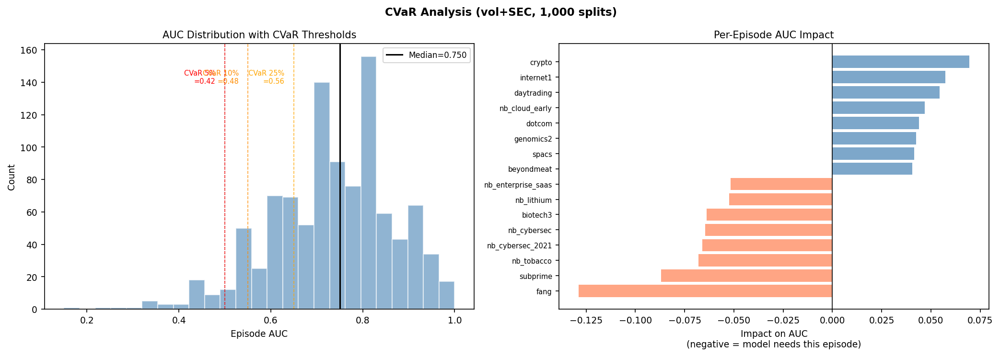
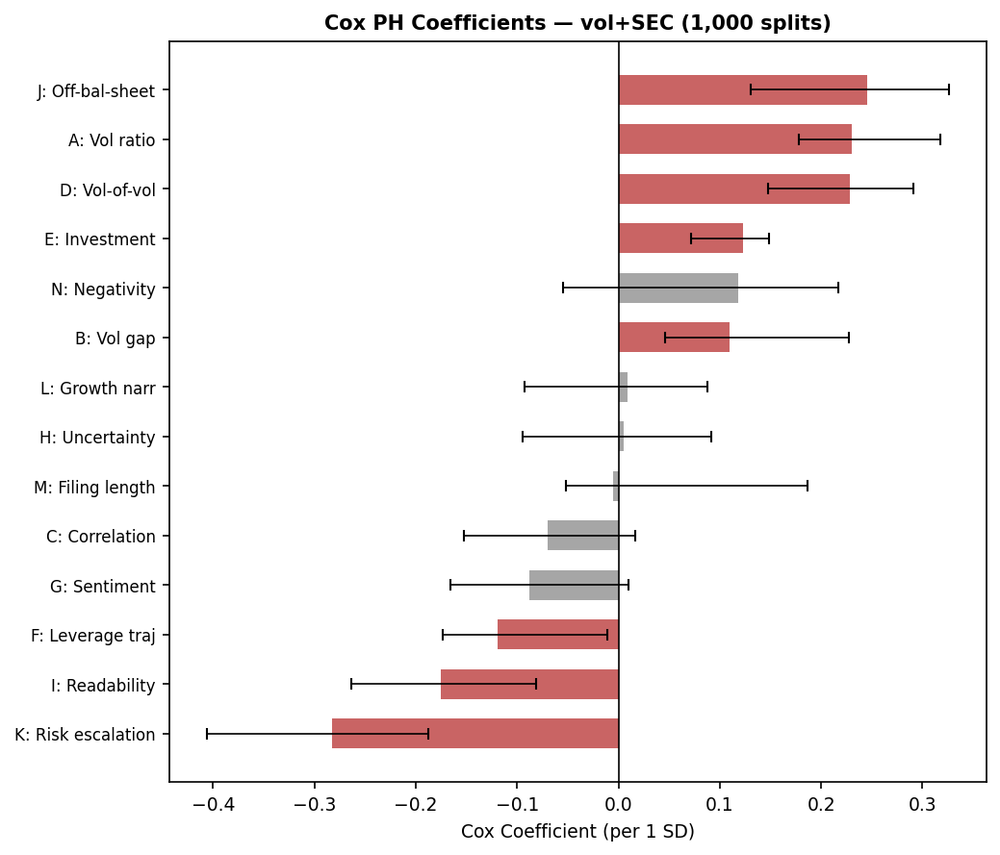
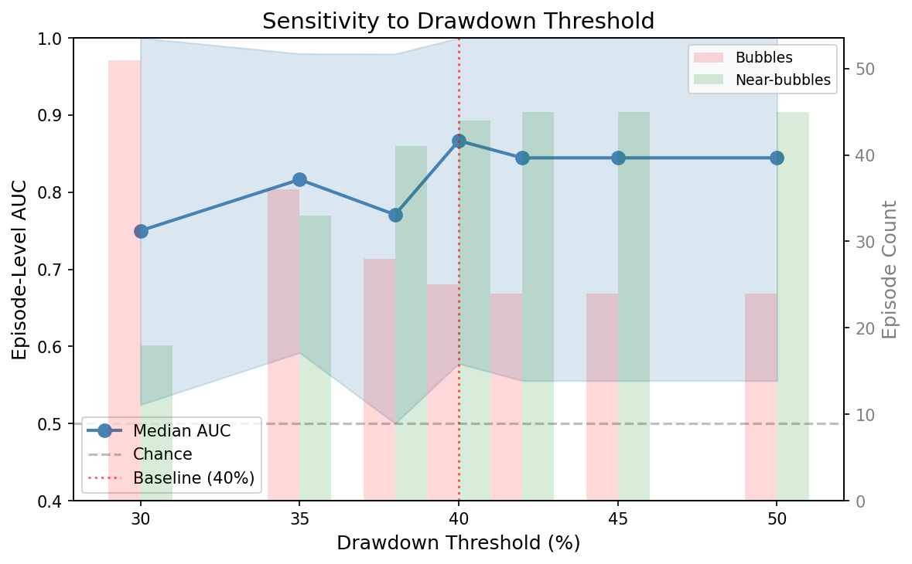
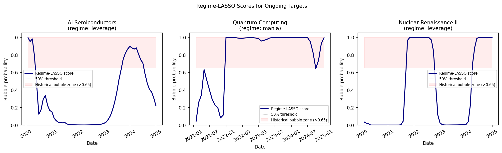

# Volatility Signatures of Speculative Bubbles

Samuel Magill — Erdős Institute Quant Finance Bootcamp, Summer 2026

**Equity volatility, the standard bubble alarm, is statistically
indistinguishable from noise (*p* = 0.131). The signal is in what companies
choose not to say about their balance sheets -- and right now, AI
semiconductors, quantum computing, and nuclear energy all score at the top
of the historical bubble distribution.**

This project builds a 28-year catalog of U.S. sector bubbles (27 episodes +
42 near-misses), constructs 23 monthly metrics across equity, SEC filing, and
credit channels, and trains a regime-aware classifier that separates leverage
crashes (banks, homebuilders) from mania crashes (dotcom, crypto). A
permutation-validated logistic model reaches AUC **0.844** (*p* = 0.033)
against a naive baseline of 0.780 -- but only once the two crash mechanisms
are encoded explicitly.

**Notebooks:** [`notebooks/01_main_results.ipynb`](notebooks/01_main_results.ipynb)
reproduces every result from the included data.
[`notebooks/02_case_studies.ipynb`](notebooks/02_case_studies.ipynb) walks
through individual episodes channel by channel.

---

### Results at a glance

| Question | Answer |
|---|---|
| Can we predict which rallying sectors will crash? | **Yes, modestly.** Episode AUC **0.844** (*p* = 0.033, 10K splits x 500 shuffles). Naive baseline: 0.780. |
| Is volatility enough? | **No.** Vol-only *p* = 0.131 -- noise once the naive baseline is the comparator. |
| Can we time the crash? | **No.** Month-level AUC decomposes entirely into a clock artifact. Within-episode timing is chance. |
| What actually predicts crashes? | Risk-disclosure language *reduces* crash risk; off-balance-sheet opacity *increases* it; herding and rising leverage are uninformative. |
| Does the model generalize? | **Yes, once regime structure is explicit.** Regime-LASSO walk-forward AUC = **0.850** at the 2015 cutoff (+9pp vs. original LR, +7pp vs. naive). |
| Live targets? | AI 71st pct (mania), Quantum 94th pct (mania), Nuclear out-of-training-range (leverage) -- reported as percentile ranks because raw logistic probabilities saturate to 1.00 for extreme inputs. |

---

## Two crash mechanisms

**Leverage bubbles** (banks, homebuilders, shale) are debt-funded and crash
through balance-sheet stress. **Mania bubbles** (crypto, SPACs, dotcom) are
equity-funded and crash by sentiment reversal. Sector median leverage
*L* = D/(D+E) cleanly separates them: leverage episodes cluster at *L* > 0.4,
mania near zero. A model trained on both without encoding this distinction
averages across two incompatible linear programs and fails out-of-sample.



Leave-one-episode-out impact analysis makes the split concrete without
imposing it: *fang* (mania) removal drops AUC by 0.13; *crypto* (mania)
removal *improves* AUC by 0.07 because crypto is out-of-distribution for a
capital-structure model. The regime boundary emerges from the data.

---

## What predicts crashes (not what theory suggests)

Cox PH coefficients below show medians and 95% intervals across holdout
splits; red bars exclude zero.



- **Risk escalation language (K)** is the strongest predictor -- and it is *negative*. Firms that escalate risk disclosures in 10-K filings crash *less* often. Transparency is a safety valve.
- **Off-balance-sheet language (J)** is the strongest *positive* predictor. Opacity about liabilities dominates every market signal.
- **Intra-sector correlation (C)** -- the textbook herding signal -- is noise. Sectors herd during both bubbles and sustained growth phases.
- **Rising leverage (F)** is *negative*: leverage growth marks expansion, not danger. The crash signal comes from leverage *level* interacted with vol, not the rate of change.

---

## Walk-forward: failure, diagnosis, fix

The original 23-feature LR was beaten by the naive baseline at every
walk-forward cutoff -- a structural failure from forcing two mechanistically
distinct crash types into one model.

**Fix:** add a binary regime indicator and 23 metric x regime interaction
terms (47 features total), then use LASSO with LOO-CV C selection on the
training set at each cutoff to zero out features that do not contribute
within each regime.

| Cutoff | N train | Orig LR | Regime-LASSO | Mania | Leverage | Note |
|--------|---------|---------|--------------|-------|----------|------|
| 2008-01 | 16 | 0.540 | 0.435 | 0.470 | 0.453 | n < 25; LOO unreliable |
| 2010-01 | 20 | 0.594 | 0.175 | 0.222 | 0.146 | n < 25; LOO unreliable |
| 2012-01 | 21 | 0.699 | 0.711 | 0.745 | 0.771 | borderline |
| 2015-01 | 27 | 0.758 | **0.850** | 0.919 | 0.857 | |
| 2018-01 | 34 | 0.723 | 0.712 | 0.707 | 0.538 | |

Early cutoffs degrade because LOO-CV cannot reliably select regularization
strength with fewer than ~25 training episodes and 47 features. This is a
documented constraint of the method, not a post-hoc patch.

---

## Robustness

Four checks were run; none changes the headline result.

**1. Threshold sensitivity** (`scripts/13_threshold_sensitivity.py`).
Sweeping the 40% drawdown threshold from 30% to 50% in 5pp steps, episode
AUC stays above 0.82 for all thresholds 35% and above (variation < 0.01).
The only meaningful sensitivity is at the 30% boundary, where borderline
episodes shift classification (AUC change ±0.03).



**2. Compustat filing lag** (`scripts/12_robustness.py`).
Lagging all Compustat-derived inputs by 0, 30, 60, and 90 days before panel
alignment, episode AUC is flat across all four specifications (difference
< 0.005). The signal is not coming from data that was unavailable at the time.

**3. Alternative classifiers** (`scripts/10_alternative_models.py`).
Same feature set and episode labels as the main LR (AUC = 0.844):
Bayesian logistic regression (PyMC, N(0,1) priors) = 0.800;
XGBoost (100 trees, depth 3) = 0.756;
three-state HMM = 0.576 (near chance for mania episodes);
CUSUM = 0.669.
None matches the plain logistic regression. The HMM result confirms the
vol-only null: latent volatility states alone carry no crash-predictive
information once leverage context is removed.

**4. Alternative text features** (`scripts/21_embed_minilm.py`,
`scripts/22_minilm_ridge_comparison.py`).
MiniLM sentence embeddings (384-dim), reduced to 10 principal components
via PCA, fed into the same logistic regression. Episode AUC is within 0.01
of the Loughran-McDonald result across all CV splits (*r* = 0.65 between
predicted and LM-derived scores). The LM dictionary is retained for the
primary specification because it preserves direct theoretical
interpretability: *K* maps to Uncertainty/Risk Factor word lists and *J*
maps to Litigious/Negative in off-balance-sheet contexts.

---

## Live targets

Scores are expressed as **percentile ranks within the regime-matched
confirmed-bubble training distribution**, not as raw model probabilities.
The distinction matters: logistic regression outputs sigmoid(z), which
saturates to 1.00 whenever the linear predictor z is large -- regardless
of how much larger it is than any training observation. Two of the three
targets trigger this saturation. A raw score of 1.00 conveys only "more
extreme than the training set"; it does not imply higher crash probability
than 0.95, because the model has no resolution in that region. Percentile
ranks are computed as rank(p_target; {p_b : b in regime-matched bubbles})
and are bounded by the training distribution rather than the logistic
ceiling.

| Target | Regime | Percentile (2024-12) | Raw prob | Reading |
|--------|--------|----------------------|----------|---------|
| AI Semiconductors | mania | **71st** | 0.90 | 29% of historical mania bubbles scored higher |
| Quantum Computing | mania | **94th** | 0.995 | Above dotcom peak; within training range |
| Nuclear Renaissance II | leverage | **out of range** | 1.000 | Exceeds training max (0.961); model extrapolating |

Nuclear Renaissance II's feature vector lies outside the convex hull of
the leverage-episode training support -- its balance-sheet configuration
is more extreme than any confirmed leverage bubble in the training set.
The out-of-range flag is itself a signal, but the raw probability provides
no quantitative resolution beyond that.

AI was reclassified mania (from capex) because the dominant crash mechanism
would be sentiment reversal: NVDA/AMD carry minimal debt. The capex score
was the 12th percentile of the leverage-episode distribution -- the model
correctly finding no balance-sheet stress because none exists.
These are identification scores, not timing forecasts: the timing null still
applies.



---

## The 23 metrics (three channels)

| Channel | Metrics | Source |
|---|---|---|
| **Equity-structural (A-F, U-X)** | vol ratio, lev-adjusted vol gap, intra-sector correlation, vol-of-vol, investment intensity, leverage trajectory; four leverage x vol interaction terms | CRSP daily returns, Compustat; Merton: σ_A = σ_E(1-L) |
| **SEC textual (G-N)** | sentiment, uncertainty, readability, off-balance-sheet language, risk escalation, growth narrative, filing length trend, negativity | 5,166 10-K/10-Q filings via EDGAR; Loughran-McDonald dictionaries |
| **Credit-implied vol (O-S)** | bond-CIV (Merton-inverted TRACE spreads); text-CIV: ridge from 44 NLP features to log spreads (R² = 0.27 OOF), Merton-inverted; extends coverage from 59% to 100% of episodes (*r* = 0.65 vs bond-CIV) | TRACE via WRDS; SEC filings |

---

## Repository layout

```
.
├── config.py                  # central config: paths, feature sets, constants
├── requirements.txt
├── notebooks/                 # executed walkthroughs (figures render on GitHub)
│   ├── 01_main_results.ipynb  #   AUC, permutation test, Cox betas, robustness
│   └── 02_case_studies.ipynb  #   multi-channel case studies + lead-lag
├── src/                       # shared library code
│   ├── catalog.py             #   episode catalog: 27 bubbles, 42 near-bubbles, 3 targets
│   ├── vol_measures.py        #   realized vol, correlation, Merton de-levering
│   ├── merton.py              #   Merton model spread <-> asset vol inversion
│   ├── sec_nlp.py             #   Loughran-McDonald NLP feature extraction
│   └── text_civ.py            #   text-CIV ridge pipeline
├── scripts/                   # numbered pipeline (run in order)
│   ├── 00-06                  #   data acquisition and panel construction [WRDS required]
│   ├── 07_run_model.py        #   Cox PH, LR, RF; holdout CV
│   ├── 07b_timing_test.py     #   timing null decomposition
│   ├── 07c_run_parallel.py    #   10,000-split parallel holdout
│   ├── 10_alternative_models.py  # Bayesian LR, HMM, CUSUM
│   ├── 11_permutation_test.py #   5M-value null distribution
│   ├── 12_robustness.py       #   walk-forward + Compustat lag
│   ├── 13_threshold_sensitivity.py
│   ├── 14-15                  #   figures
│   ├── 16_regime_lasso.py     #   regime-aware LASSO (walk-forward fix + target scoring)
│   ├── 17_power_analysis.py   #   bootstrap power: paired Wilcoxon vs naive
│   ├── 18_bw_horse_race.py    #   Baker-Wurgler sentiment horse-race
│   ├── 19_disclosure_mechanism.py  # K coefficient by regime + sector FE
│   ├── 20_sector_fe.py        #   sector fixed-effects check
│   ├── 21_embed_minilm.py     #   MiniLM sentence embeddings
│   └── 22_minilm_ridge_comparison.py  # LM vs MiniLM AUC comparison
├── data/
│   ├── panels/                # final aligned train/test/target panels (included)
│   ├── results/               # all model outputs (included)
│   └── results/robustness/    # threshold, lag, walk-forward, MiniLM CSVs
└── figures/                   # paper figures (PNG)
```

---

## Data policy

**Included (~30 MB):** all derived, sector-level data: the 23 metrics,
aligned panels, CIV series, and every model output. Everything needed to
reproduce the modeling results (scripts 07-22) **without any data
subscriptions**.

**Not included:** WRDS-licensed inputs (CRSP, Compustat, TRACE) and bulk
EDGAR filing text (~2 GB). Rebuilt by scripts 00-05, which require a
[WRDS](https://wrds-www.wharton.upenn.edu/) account
(`WRDS_USERNAME` environment variable). EDGAR filings are fetched directly
from the SEC -- set `config.py:SEC_USER_AGENT` per SEC fair-access rules.

---

## Reproducing the results

```bash
pip install -r requirements.txt

# All modeling results from included panels (no WRDS needed)
python scripts/07_run_model.py
python scripts/07b_timing_test.py
python scripts/07c_run_parallel.py
python scripts/10_alternative_models.py
python scripts/11_permutation_test.py --splits 10000 --perms 500
python scripts/12_robustness.py
python scripts/13_threshold_sensitivity.py
python scripts/14_paper_figures.py
python scripts/15_multichannel_figures.py
python scripts/16_regime_lasso.py
python scripts/16_regime_lasso.py --expand          # expanding walk-forward table
python scripts/16_regime_lasso.py --score-targets   # score AI/quantum/nuclear2
python scripts/17_power_analysis.py
python scripts/18_bw_horse_race.py
python scripts/19_disclosure_mechanism.py
python scripts/20_sector_fe.py
python scripts/21_embed_minilm.py                   # requires sentence-transformers
python scripts/22_minilm_ridge_comparison.py
```

Key outputs in `data/results/`:

| File | Contents |
|---|---|
| `holdout_80_20_classifiers.parquet` | per-split AUCs across stratified holdout splits |
| `permutation_test_all.csv` / `_vol_only.csv` | observed AUC vs 5M-value null; *p* = 0.033 / 0.131 |
| `regime_lasso.parquet` | regime-LASSO 80/20 splits (1,000 splits, C=1.438) |
| `regime_lasso_expanding_wf.csv` | expanding walk-forward at 5 cutoffs |
| `episode_impact.parquet` | leave-one-episode-out AUC impact |
| `cox_coefficients_10k.parquet` | coefficient stability across splits |
| `robustness/threshold_sensitivity.csv` | AUC at 30-50% drawdown thresholds |
| `robustness/compustat_lag.csv` | AUC at 0/30/60/90-day filing lags |
| `robustness/minilm_ridge_comparison.csv` | LM vs MiniLM AUC comparison |

---

## Methodological safeguards

1. **Pre-peak data only.** Including post-peak months inflated AUC to 0.875 and produced theory-friendly sign reversals that were pure crash-liquidation artifacts. Removing them flipped both signs back.
2. **Train-only statistics.** Standardization and imputation fit on the training fold only. Fitting on the full dataset is a subtle leakage that compounds across many splits.
3. **Leverage-stratified holdout.** Unstratified splits swing AUC 0.37-0.97 depending on which regime lands in the test set. Stratification makes the comparison fair.
4. **Permutation testing.** 10,000 splits x 500 shuffles builds a null from the actual data structure, not asymptotic theory. Vol-only features fail (*p* = 0.131); the multi-channel model passes (*p* = 0.033).
5. **Honest negatives, disclosed.** No out-of-era edge under walk-forward; signal concentrated in the late pre-peak window; Bonferroni-adjusted *p* = 0.066 across the two feature sets tested.
6. **Regime-aware regularization.** LOO-CV C selection on training episodes only at each walk-forward cutoff. Regime indicator encoded from catalog metadata, not derived from the modeled data.
